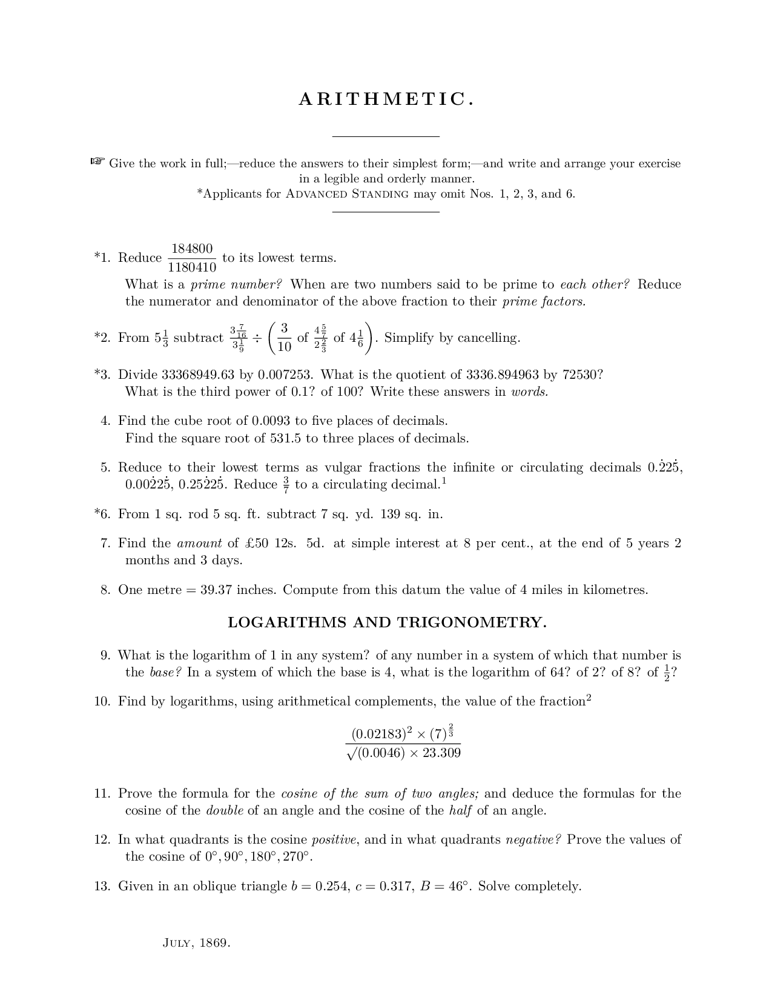
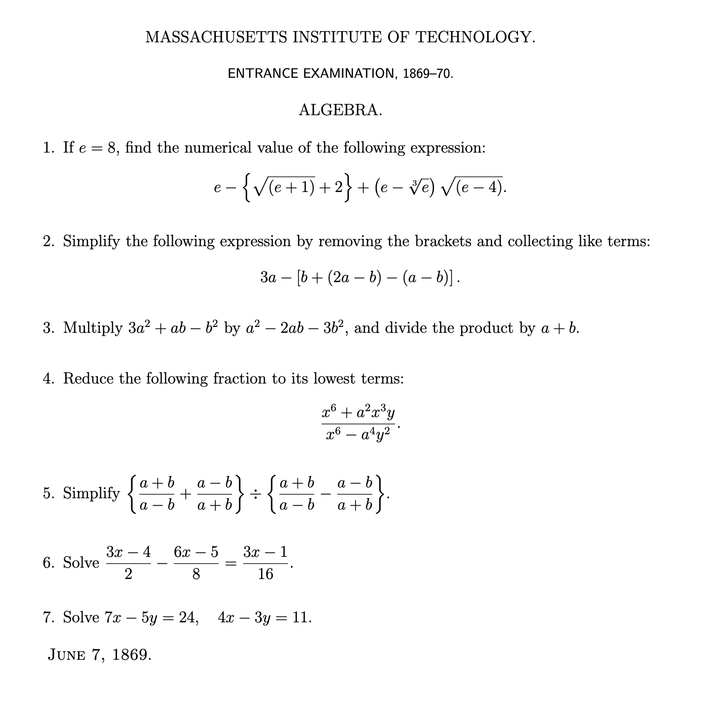

# Historical Entrance Exams (LaTeX)

This repository contains LaTeX recreations of historical entrance examinations: the kinds of tests students once had to pass for admission to universities like Harvard, MIT, and others. The goal is to preserve, explore, and typeset these exams in a clean, consistent, and reusable format.




## Contents

- Recreated exam papers in LaTeX (`.tex` files)
- Generated PDFs of each exam
- Supporting assets (figures, diagrams, etc.)


## Motivation
These documents are valuable not only as a historical curiosity but also as a window into the standards and expectations of earlier eras of education. By recreating them in LaTeX, we ensure that they are easy to read, compile, and adapt for teaching or research.

## Getting Started

### Requirements
You’ll need a working LaTeX distribution, such as:
- [TeX Live](https://www.tug.org/texlive/)
- [MacTeX](https://tug.org/mactex/)
- [MiKTeX](https://miktex.org/)

Alternatively, you can drop the `.tex` files directly into [Overleaf](https://www.overleaf.com/) and compile them online with no setup required.

### Compiling Locally
Clone the repository:
```bash
git clone https://github.com/timricchuiti/historical-entrance-exams.git
cd historical-entrance-exams
```

Compile a specific exam:
```bash
pdflatex exam_name.tex
```
This will generate a PDF in the same directory.

## Contributing

Contributions are welcome! If you’d like to add more exams:

1. Fork the repository
2. Add your `.tex` source and compiled `.pdf`
3. Submit a pull request

## License

This project is licensed under the MIT License — see the [LICENSE](LICENSE) file for details.